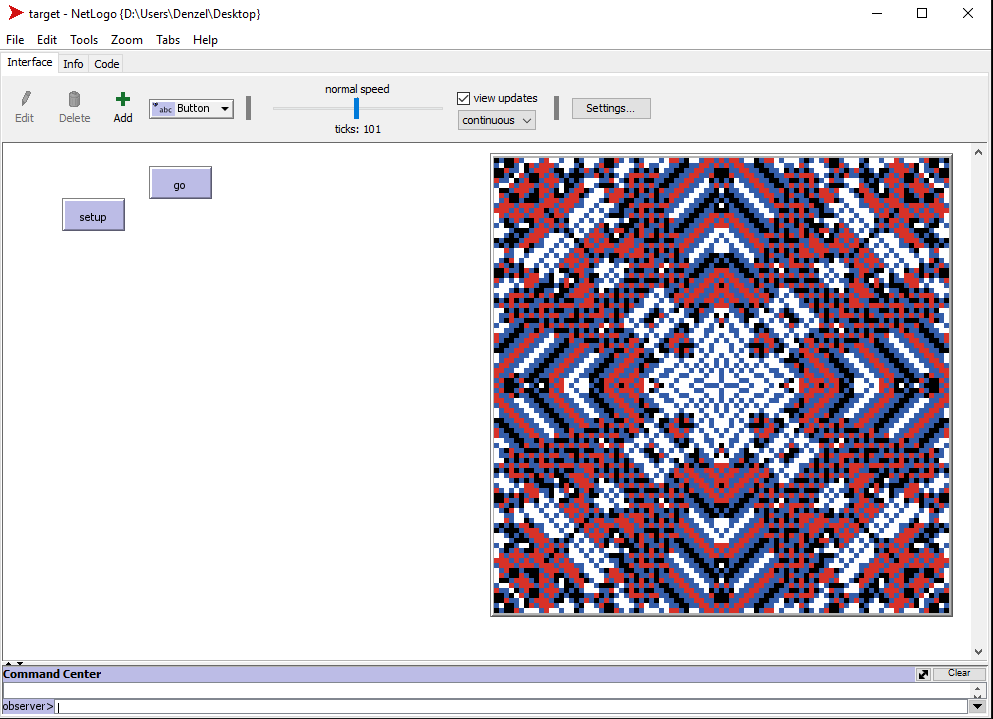

# Growing target art

## Setup
To run the program, NetLogo must be installed. 
\
Search for NetLogo and download the latest stable version. After successfully installing NetLogo, run the application and you may now run the program.

## About
The 2D cellular automata made use of 4 colors, namely black, white, blue, and red. The initial setup of the field is a 45x45 white square with a 3x3 patch of black pixels in the center. 

Each patch has a property "new-color" which is supposed to be the new supposed color of each partch after running each patch with the various rules in the code.
\
This was done so that the patches won't change color during the execution which may affect the symmetry and desired design of the resulting output.

The rules are as follows:
\
If the current patch color is white: 
- If its black Moore neighbors are more than 1 and its red Von Neumann neighbors are more than 1, then set its "new-color" to black.
- If its red Von Neumann neighbors are more than 1, then set its "new-color" to blue.
- If its blue Moore neighbors are more than 2, then set its "new-color" to black.

If the current patch color is black:
- If its black Moore neighbors are more than 2, then set the "new-color" to red.

If the current patch color is red:
- If its red Moore neighbors are more than 2, then set the "new-color" to white.

After determining each patch's "new-color", apply the "new-color" change to each patch which may cause the image to change. 

The rules are then repeated up to 101 times until the pattern is formed. The output of the program remains consistent over multiple reruns with the image alternating over 4 different colored patterns. The following are the alternating patterns.

## Execution
To run the program, make sure you are in the interface tab. You can see this at the top of the screen where you will find 3 tabs namely: Interface, Info, Code. 
After confirming the correct tab, first click on the "setup" button. What should appear in the square field is a white box with a small black spot in the middle. 
Second, click on the "go" button which will then run the code. The program will stop once the desired pattern is found. (look below for an example of the pattern) 

## Authors
- Caoile, Sean
- Yongco, Denzel

## Image

